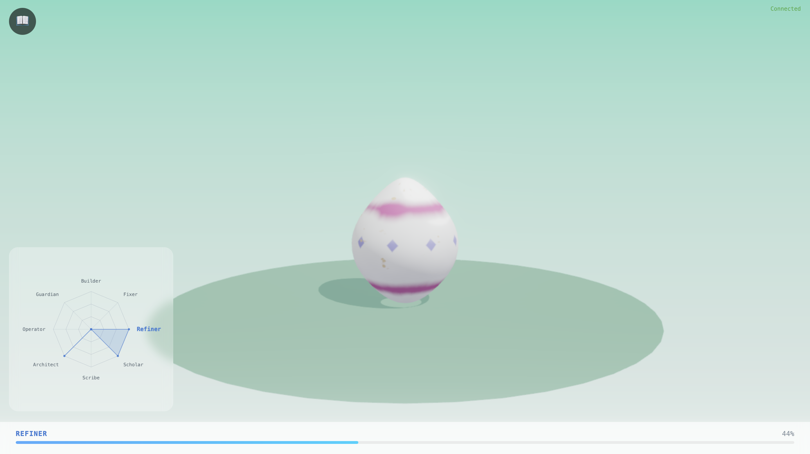
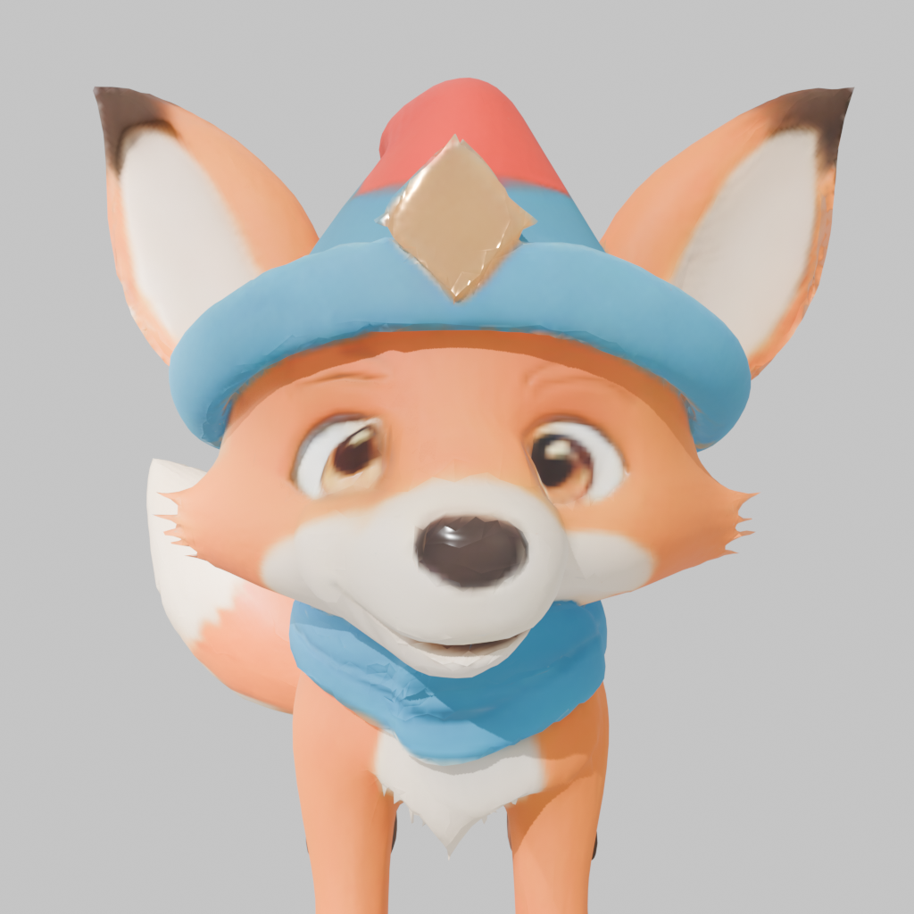
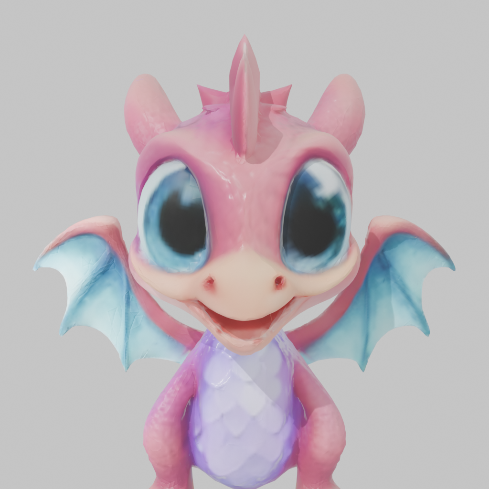
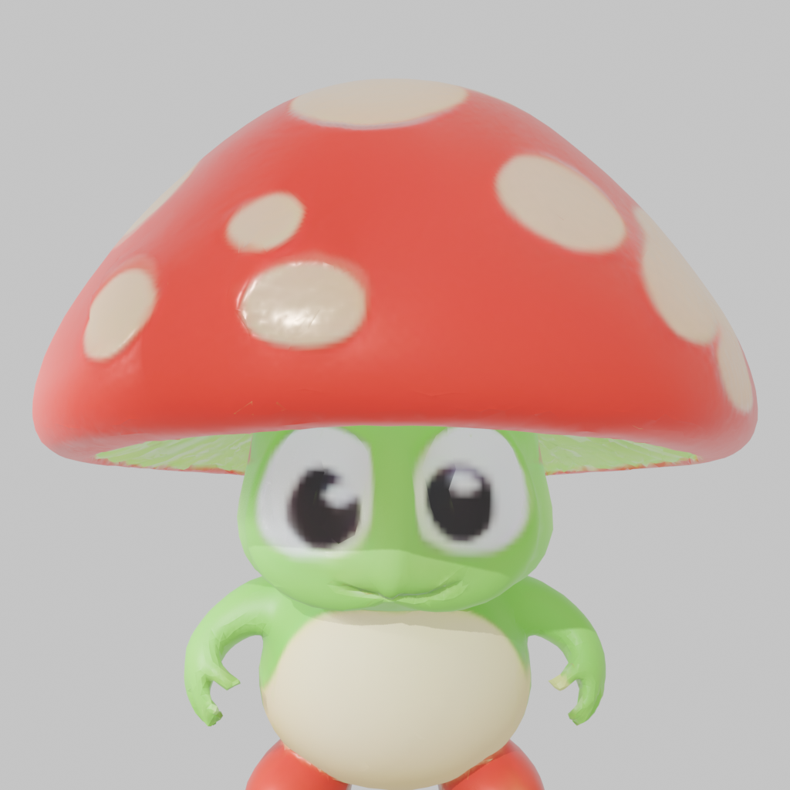

<p align="center">
  
</p>

# tomotoken

Your Claude Code token usage, visualized as a growing pet.

Tomotoken reads your local session logs, counts the tokens, and grows a creature that hatches from an egg, develops a personality from your coding habits, and eventually completes. Then you get a new egg. Every billion tokens produces one pet.

<p align="center">
  
  
  
</p>
<p align="center"><i>Example pets generated from real coding sessions</i></p>

<details>
<summary><strong>Demo: Egg viewer & personality radar</strong></summary>
<br>

https://github.com/user-attachments/assets/e891dd20-e8b3-4df6-b376-e20e3f8bdf78

</details>

<details>
<summary><strong>Demo: Collection gallery</strong></summary>
<br>

https://github.com/user-attachments/assets/38f66f13-f25d-433c-b37b-ad5b66298ade

</details>

## Quick start

```bash
git clone https://github.com/cawa102/tomotoken.git
cd tomotoken
npm install
npm run build
export ANTHROPIC_API_KEY=sk-ant-...   # or set in ~/.tomotoken/config.json
npm start
```

Opens at `http://localhost:3456`. On first launch, tomotoken scans your recent Claude Code sessions and creates your first pet instantly -- no blank egg.

## What you get

- 3D character in the browser via Three.js, designed by an LLM, optionally post-processed with Blender
- Personality traits computed from how you actually use Claude Code (file types, tools, bash habits, session depth)
- A collection of completed pets you can browse in the collection gallery with card grid and detail modals
- Automatic PNG snapshots captured when a pet completes

## Requirements

- Node.js 18+
- Claude Code installed and used (reads `~/.claude/projects/` logs)
- API key: `ANTHROPIC_API_KEY` or `OPENAI_API_KEY` (for creature design generation)
- Blender 4.x in your PATH (optional, for 3D model post-processing)

## API key setup

Tomotoken uses an LLM to generate creature designs. You need an API key from one of these providers:

- **Anthropic** (default): [console.anthropic.com](https://console.anthropic.com) -> API Keys -> Create Key
- **OpenAI**: [platform.openai.com/api-keys](https://platform.openai.com/api-keys) -> Create new secret key

Set it as an environment variable:

```bash
export ANTHROPIC_API_KEY=sk-ant-...
```

Or put it in `~/.tomotoken/config.json`:

```json
{
  "llm": {
    "provider": "anthropic",
    "apiKey": "sk-ant-..."
  }
}
```

<details>
<summary>OpenAI configuration</summary>

```json
{
  "llm": {
    "provider": "openai",
    "model": "gpt-5.2",
    "apiKey": "sk-..."
  }
}
```

The default Anthropic model is `claude-sonnet-4-6-20250620`. The default OpenAI model is `gpt-5.2`.

</details>

## Usage

```bash
npm start
```

The main page shows your current pet in 3D with a personality radar chart and progress bar. Click the book button to browse your completed pets in the collection.

To change the port:

```bash
VIEWER_PORT=4000 npm start
```

## How it works

Tomotoken reads Claude Code's JSONL session logs from `~/.claude/projects/`. It counts input tokens, output tokens, cache creation tokens, and cache read tokens from each API call.

Four stages run on each poll cycle:

1. **Ingestion** reads logs and tracks byte offsets so it only processes new data on each run.
2. **Progression** accumulates tokens toward the current pet. One pet per billion tokens. If a single delta crosses the threshold, overflow carries to the next pet.
3. **Personality** classifies your sessions by coding behavior (file extensions edited, tool transitions, bash commands, tool distribution) and computes 8 trait scores. The highest trait becomes the archetype, the second becomes the subtype.
4. **Viewer** serves the 3D pet via Express + WebSocket at localhost:3456, pushing updates every 5 seconds.

The 3D pipeline runs alongside. An LLM writes a creature description from the pet's personality. Hyper3D generates a 3D model from that description. Blender post-processes it (lattice deformation for eye enlargement, decimation to 20K faces, smooth shading at 60 degrees). Three.js renders the result in the browser.

## Pages

- **Main** (`/`) -- 3D viewer with your current pet, personality radar chart, and progress bar
- **Collection** (`/collection`) -- Card grid of completed pets with snapshot thumbnails, click to open detail modal with 3D viewer and trait badges

## Configuration

Config lives at `~/.tomotoken/config.json`. Everything has defaults, so this file is optional.

| Key | Default | What it does |
|-----|---------|-------------|
| `logPath` | `~/.claude/projects` | Where to find Claude Code logs |
| `animation.enabled` | true | Enable/disable animation |
| `animation.fps` | 2 | Animation speed |
| `privacy.storeRawMessages` | false | Store raw message content |
| `llm.provider` | `"anthropic"` | `"anthropic"` or `"openai"` |
| `llm.model` | per provider | Model ID override |
| `llm.apiKey` | from env | API key override |

## Data storage

Files in `~/.tomotoken/`:

| File/Dir | Contents |
|----------|----------|
| `state.json` | Current pet, ingestion byte offsets, global stats |
| `collection.json` | Completed pets with personality and seed |
| `config.json` | User configuration |
| `snapshots/` | PNG screenshots of completed pets |

All writes are atomic (write to temp file, then rename). State objects are never mutated in place.

To re-read all logs from scratch: delete `~/.tomotoken/state.json` and run `npm start`.

## REST API

| Endpoint | Method | Description |
|----------|--------|-------------|
| `/api/pet` | GET | Current pet render data |
| `/api/collection` | GET | All completed pets (summary) |
| `/api/collection/:petId` | GET | Single pet detail |
| `/api/snapshot/:petId` | GET | Pet snapshot PNG |
| `/api/snapshot/:petId` | POST | Upload pet snapshot (image/png) |

## Development

```bash
npm test              # vitest
npm run test:coverage # 80% coverage thresholds
npm run typecheck     # tsc --noEmit
npm run build         # tsup -> dist/
```

Tests live in `test/` mirroring the `src/` structure. Fixtures in `test/fixtures/`.

## Project structure

```
src/
  ingestion/     Log scanning and token counting
  progression/   Pet advancement (1B tokens per pet)
  personality/   Session classification and trait computation
  creature/      Creature parameter types and palette generation
  generation/    LLM-based creature design (optional)
  art3d/         Hyper3D prompt building and style guide
  viewer/        Express server, Three.js client, collection API, snapshots
  sidecar/       Pipeline runner, outputs JSON for viewer
  store/         JSON state persistence
  config/        Zod-validated configuration
```

## License

MIT
